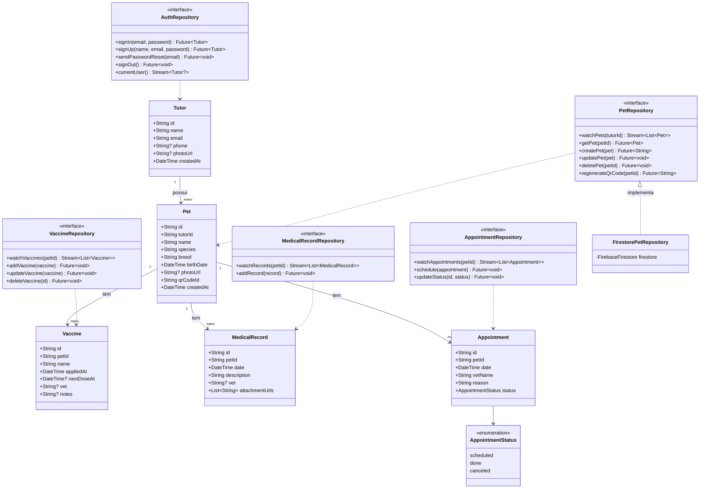

# Diagrama de Classes — PetConnect

Modelos de domínio (`lib/features/*/domain`) e a camada de repositório que os acessa (`lib/features/*/data`). Nomes e campos exatos serão ajustados quando a modelagem de Firestore já existente do usuário for incorporada (ver `docs/modelo-dados-firestore.md`).

## Notas

- Repositórios são interfaces (`abstract class` em Dart) na camada `domain`, com implementação concreta usando Firestore na camada `data` — permite trocar a fonte de dados ou criar fakes para teste sem tocar na UI.
- `Pet.qrCodeId` é o identificador usado na URL pública (não deve ser sequencial — ver `docs/seguranca.md`).
- Providers Riverpod (camada `presentation/providers`) consomem essas interfaces, não as implementações concretas diretamente.
